# Estudo sobre o Teleporte Quântico

Este repositório contém um estudo sobre o protocolo de Teleporte Quântico, implementado com Qiskit. O projeto explora a transferência de estados quânticos, incluindo estados de superposição e de múltiplos qubits, através de simulações e execuções em hardware quântico real da IBM.

## Descrição

O teletransporte quântico é um processo pelo qual o estado quântico de uma partícula é transferido de um local para outro. Este projeto demonstra o teletransporte quântico através de três experimentos principais:

1.  **Teleporte de 1 Qubit**: Transferência do estado de um único qubit.
2.  **Teleporte de N Qubits**: Extensão do protocolo para múltiplos qubits.
3.  **Teleporte de um estado em Superposição**: Transferência de um qubit em um estado de superposição.

O objetivo é analisar a viabilidade e a fidelidade do teleporte quântico em simulações com e sem ruído, e comparar os resultados com a execução em computadores quânticos reais.

## Estrutura do Repositório

-   `notebook/`: Contém o Jupyter Notebook `OICQ_Projeto_Final.ipynb` com toda a implementação, simulações e visualizações dos resultados.
-   `notebook/imgs/`: Imagens dos circuitos quânticos e gráficos de resultados gerados pelo notebook.
-   `report/`: Contém o relatório do projeto em LaTeX (`main.tex`) e o PDF compilado (`main.pdf`).

## Conceitos

O teletransporte quântico baseia-se em três princípios fundamentais da mecânica quântica:

-   **Qubits e Superposição**: Um qubit pode existir em uma combinação de múltiplos estados simultaneamente.
-   **Emaranhamento Quântico**: Duas ou mais partículas podem estar em um estado emaranhado, onde o estado de uma partícula está intrinsecamente ligado ao estado da outra, não importa a distância entre elas.
-   **Medição Quântica**: A medição de um estado quântico colapsa a superposição para um estado clássico.

O protocolo de teleporte quântico utiliza um par de qubits emaranhados (um para Alice e outro para Bob) para transferir o estado de um terceiro qubit de Alice para Bob. Alice realiza uma medição de Bell em seu qubit e no qubit emaranhado, e envia os resultados (dois bits clássicos) para Bob. Bob, então, aplica uma operação quântica em seu qubit emaranhado, baseada na informação recebida, para reconstruir o estado original.

## Implementação

A implementação foi feita em Python utilizando a biblioteca **Qiskit**. O código para os experimentos está no notebook `notebook/OICQ_Projeto_Final.ipynb`.

### Requisitos

Para executar o notebook, você precisará das seguintes bibliotecas:

-   `qiskit`
-   `qiskit-aer`
-   `qiskit-ibm-runtime`
-   `matplotlib`
-   `pylatexenc`
-   `numpy`

Você pode instalar as dependências com o seguinte comando:

```bash
pip install qiskit qiskit-aer qiskit-ibm-runtime matplotlib pylatexenc numpy
```

## Experimentos e Resultados

Foram realizados três experimentos para testar o protocolo de teleporte quântico. Cada experimento foi simulado com e sem ruído e executado em um computador quântico da IBM.

### Teleporte de 1 Qubit

Neste experimento, o estado de um qubit é teleportado.

**Circuito:**
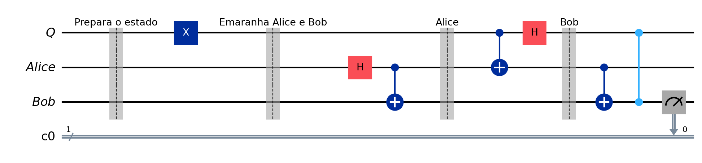

**Resultados:**
Os resultados mostraram alta fidelidade na transferência do estado, mesmo com a presença de ruído na simulação e na execução em hardware real.

| Simulação sem Ruído | Simulação com Ruído | Execução em Hardware IBM |
| :---: | :---: | :---: |
| 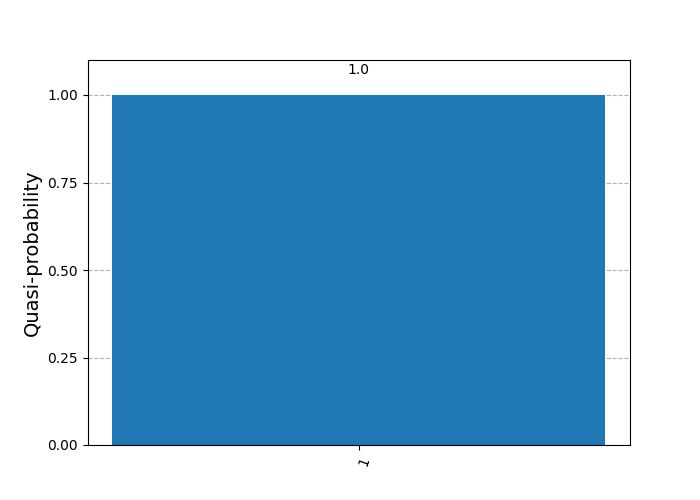 | 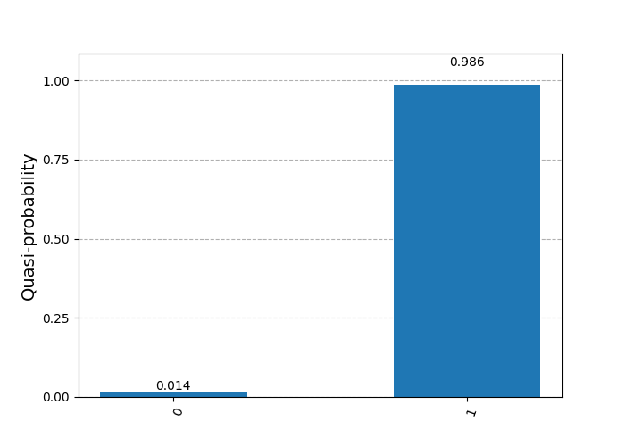 | 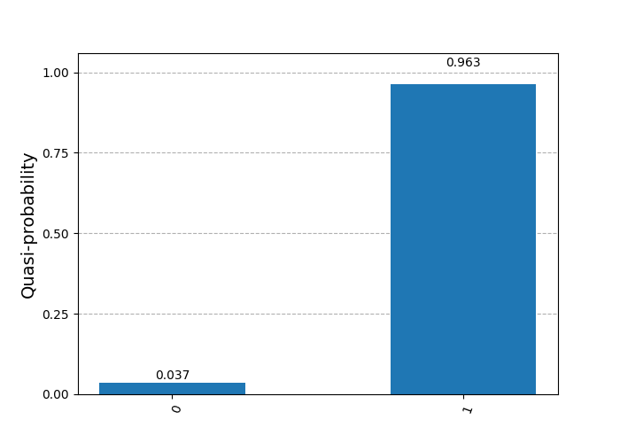 |

### Teleporte de N Qubits

O protocolo foi estendido para teleportar o estado de dois qubits.

**Circuito:**
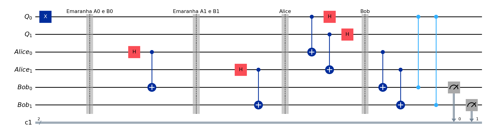

**Resultados:**
Os resultados para N qubits também mostraram uma boa fidelidade, com o ruído causando pequenas discrepâncias.

| Simulação sem Ruído | Simulação com Ruído | Execução em Hardware IBM |
| :---: | :---: | :---: |
|  | 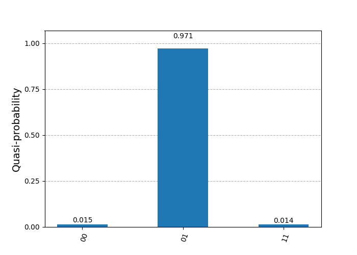 | 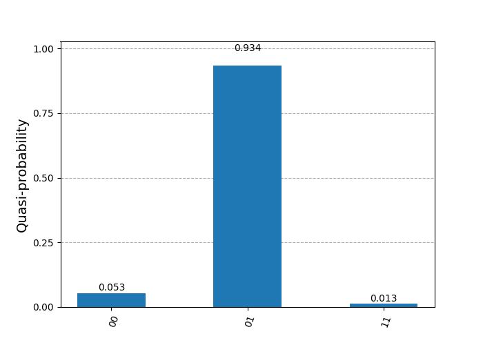 |

### Teleporte de um estado em Superposição

Este experimento teleporta um qubit em um estado de superposição.

**Circuito:**
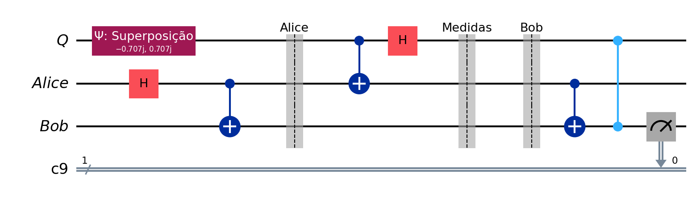

**Resultados:**
A transferência de um estado de superposição foi bem-sucedida, com os resultados mostrando a distribuição de probabilidade esperada de 50% para cada estado base, tanto nas simulações quanto na execução real.

| Simulação sem Ruído | Simulação com Ruído | Execução em Hardware IBM |
| :---: | :---: | :---: |
| 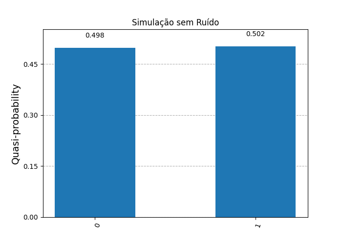 | 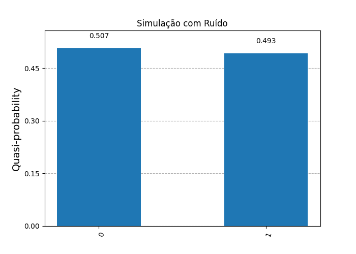 | 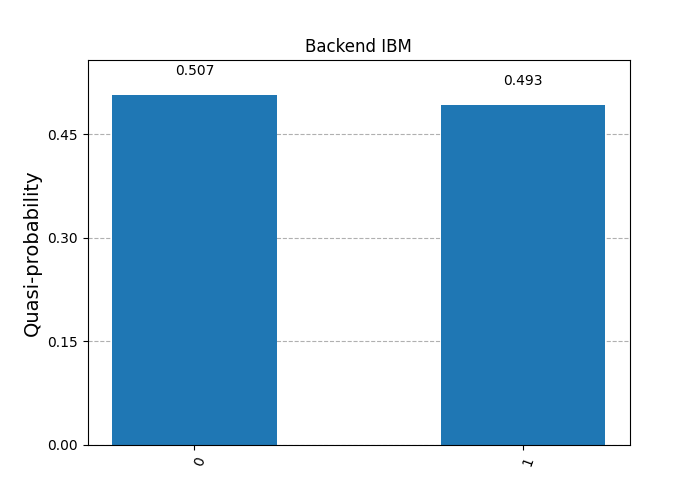 |

## Conclusão

Os experimentos demonstram a viabilidade do teleporte quântico para transferir estados quânticos com alta fidelidade. O ruído em computadores quânticos reais introduz erros, mas os resultados ainda são consistentes com a teoria. O teleporte quântico é uma tecnologia promissora para a comunicação quântica e a computação quântica distribuída, formando a base para a futura Internet Quântica.

## Referências

-   Matthew Silverman, "Quantum Teleportation | PennyLane Demos", [https://pennylane.ai/qml/demos/tutorial_teleportation](https://pennylane.ai/qml/demos/tutorial_teleportation)
-   IBM Quantum, "Quantum Teleportation", [https://quantum.cloud.ibm.com/learning/pt/courses/basics-of-quantum-information/entanglement-in-action/quantum-teleportation](https://quantum.cloud.ibm.com/learning/pt/courses/basics-of-quantum-information/entanglement-in-action/quantum-teleportation)
-   Yanofsky, N. S.; Mannucci, M. A. *Quantum Computing for Computer Scientists*. Cambridge: Cambridge University Press, 2008.